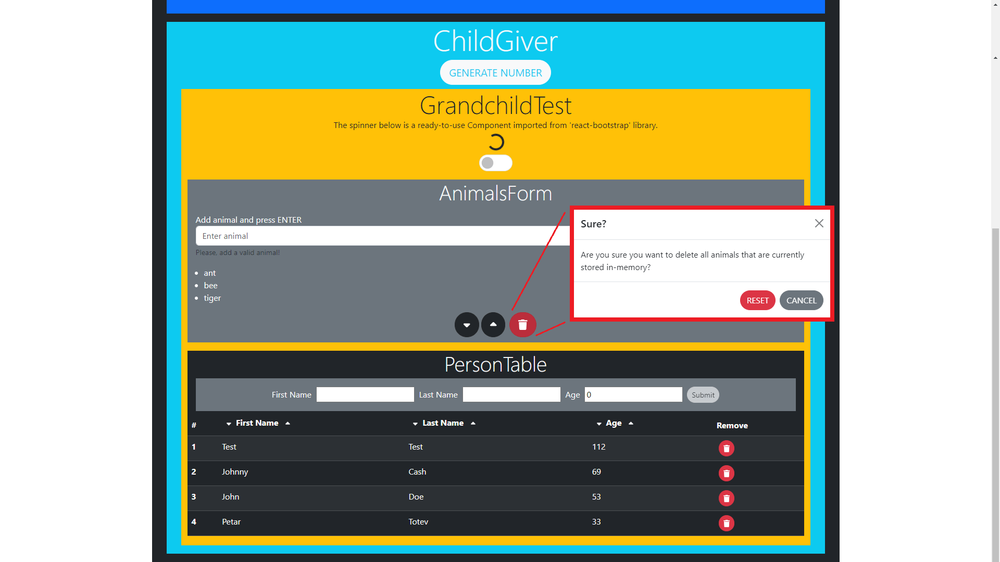
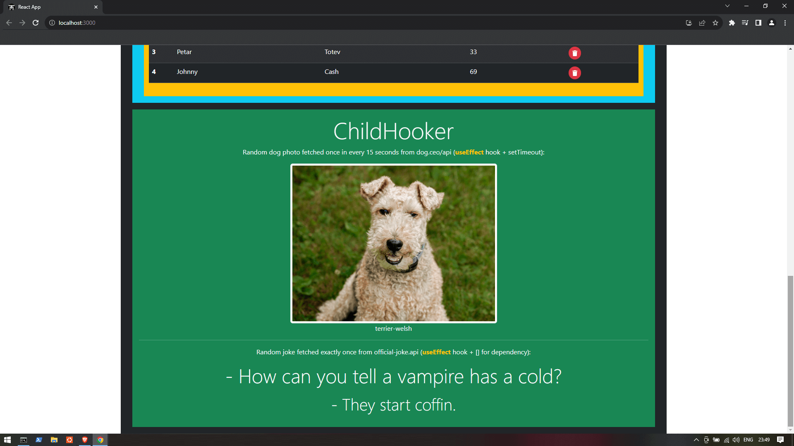

# PT_Demo_React_MyFamilyApp


## Contents

- [General Information](#general-information)
  - [Create-React-App vs Next.js](#create-react-app-vs-nextjs)
- [Create new React Project](#create-new-react-project)
  - [Prerequisites](#prerequisites)
  - [Option 1: Create-React-App (CRA)](#option-1-create-react-app-cra)
  - [Option 2: Next.js](#option-2-nextjs)
- [Debugging React App](#debugging-react-app)
  - [Set Debugging](#set-debugging)
  - [Debug Console Known Issues](#debug-console-known-issues)
- [Known Issues](#known-issues)
- [ESLint with React](#eslint-with-react)
- [Install Bootstrap 5 for React](#install-bootstrap-5-for-react)
- [Use React Bootstrap Components](#use-react-bootstrap-components)
- [Use Font Awesome](#use-font-awesome)
- [Notes](#notes)
  - [React.memo(...)](#reactmemo)
  - [The key prop](#the-key-prop)
  - [Hooks](#hooks)
- [Links](#links)
  - [React](#react)
  - [JS](#js)
  - [Debugging](#debugging)
  - [ESLint](#eslint)
  - [Bootstrap 5 and React-Bootstrap](#bootstrap-5-and-react-bootstrap)
  - [Font Awesome](#font-awesome)
  - [Others](#others)

## General Information

PT_Demo_React_MyFamilyApp is a React application using a ```Create React App (CRA)``` template.




### Create-React-App vs Next.js

CRA:
- Routing => React Router;
- Bootstrap => ```index.html``` is seeable, so you can easily add Bootstrap inside;
- ESLint => ```npm run lint``` command in ```scripts``` block of ```package.json``` needs to be added manually;

Next.js:
- Routing => Next.js built-in router;
- Bootstrap => ```_document.js``` file needs to be created, then certain contents from Docs to be copy-pasted;
- ESLint => ```npm run lint``` command in ```scripts``` block of ```package.json``` is there by default;

## Create new React Project

### Prerequisites

1. Check if you have ```node```, ```npm``` and ```npx``` installed:
```
node --version
npm --version
npx --version
```
If not, download ```node.js``` from here: https://nodejs.org/en

### Option 1: Create-React-App (CRA)

2. Create new [CRA](https://create-react-app.dev/) React app using the following command:
```
npx create-react-app my-family-app
```

3. Run the application on default port 3000 using:
```
npm start
```

### Option 2: Next.js

2. Create new [Next.js](https://nextjs.org/) React app using the following command:
```
npx create-next-app my-family-app
```
This will install the development environment along with all necessary dependencies (```react```, ```react-dom```, ```next```).

3. If asked, answer the following questions as follows:

- Would you like to use TypeScript?
	- No
- Would you like to use ESLint?
  - Yes
- Would you like to use Tailwind CSS?
  - No
- Would you like to use `src/` directory?
  - No
- Would you like to use App Router? (recommended)
  - No
- Would you like to customize the default import alias?
  - No

4. Run the application on default port 3000 using:
```
npm run dev
```

## Debugging React App

### Set Debugging

In order to debug React Create App (RCA) in Visual Studio Code (VSC), you need to follow these steps:

1. In VSC, go to ```[Run]``` tab > ```[Add Configuration...]``` > select ```Web App (Chrome)```

This should have created a new ```.vscode``` directory containing a ```launch.json``` file.

2. Change ```launch.json``` as follows:
```
{
    "version": "0.2.0",
    "configurations": [
        {
            "type": "chrome",
            "request": "launch",
            "name": "Launch Chrome against localhost",
            "url": "http://localhost:3000", // change from 8080 to 3000
            "webRoot": "${workspaceFolder}/src" // add /src
        }
    ]
}
```
3. Set a breakpoint somewhere in code
4. Run the application on port 3000 using:
```
npm start
```
5. Go to ```[Run]``` tab > ```[Start Debugging]``` or press F5
6. Voila! You should have hit the breakpoint!

---

N.B. If you are using Google Chrome for debugging purposes, you can add the ```React Developer Tools``` Extension which will give you 2 new tabs in the Inspect (F12) section:
- Components - shows a tree of all Components
- Profiler - analyzes performance

---

### Debug Console Known Issues

```⚠️ Warning: Invalid DOM property `for`. Did you mean `htmlFor`?```
```
<label for="exampleInputAnimal1">Add animal and press ENTER</label>
```
Fix:
```
<label htmlFor="exampleInputAnimal1">Add animal and press ENTER</label>
```

---

```⚠️ Warning: Each child in a list should have a unique "key" prop.```
```
<ul>{myAnimals.map(x => <li>{x}</li>)}</ul>
```
Fix:
```
<ul>{myAnimals.map((x, index) => <li key={index}>{x}</li>)}</ul>
```

Check [The key prop](#the-key-prop) in [Notes](#notes) section for more information.

---

```⚠️ Warning: Invalid DOM property `tabindex`. Did you mean `tabIndex`?```

```
<div className="modal fade text-dark" id="staticBackdrop" data-bs-backdrop="static" data-bs-keyboard="false" tabindex="-1" aria-labelledby="staticBackdropLabel" aria-hidden="true">
...
</div>
```
Fix:
```
<div className="modal fade text-dark" id="staticBackdrop" data-bs-backdrop="static" data-bs-keyboard="false" tabIndex="-1" aria-labelledby="staticBackdropLabel" aria-hidden="true">
...
</div>
```

```⚠️ Too many re-renders. React limits the number of renders to prevent an infinite loop.```

```
<FontAwesomeIcon="fa-caret-down" onClick={setState([...myPeople].sort((a,b) => a.firstName))} />
```
Fix:
```
<FontAwesomeIcon="fa-caret-down" onClick={() => setState([...myPeople].sort((a,b) => a.firstName))} />
```

## Known Issues

```⚠️ onClick property function triggers without click```
```
<button onClick={setMyAnimals([...myAnimals].sort())}>CLICK</button>
```
Fix:
```
<button onClick={() => setMyAnimals([...myAnimals].sort())}>CLICK</button>
```

## ESLint with React

If you are using Visual Studio Code (VSC) you can install the ```ESLint``` Microsoft extension which will immediately show any rule violations right inside the editor.

Otherwise, in order to execute ESLint for all ```.js``` files in your React repository, you need to:
1. Add the following line in the ```"scripts"``` block of the ```package.json``` file:
```
{
  ...,
  "scripts": {
    ...
    "lint": "eslint src --ext .js,.jsx,.ts,.tsx"
  },
  ...
}
```
This step is needed only for ```CRA``` applications. For ```Next.js```, the script alias is allegedly added by default.

2. Run the following command:
```
npm run lint
```

## Install Bootstrap 5 for React

You can use the following link as a reference:  
https://www.geeksforgeeks.org/how-to-install-bootstrap-in-react-js/

1. In command prompt, set the React project directory as current:
```
cd my-family-app
```
2. Using node package manager, install bootstrap:
```
npm install bootstrap
```
3. in ```index.js```, add the following on top:
```
import 'bootstrap/dist/css/bootstrap.min.css';
import 'bootstrap/dist/js/bootstrap.bundle.min';
```
4. Using node package manager, install jquery popper.js:
```
npm install jquery popper.js
```
5. ```in index.js```, add the following 2 lines below the lines added in step 3:
```
import 'bootstrap/dist/css/bootstrap.min.css';
import 'bootstrap/dist/js/bootstrap.bundle.min';
import $ from 'jquery';
import Popper from 'popper.js';
```

## Use React-Bootstrap Components

1. In command prompt, set the React project directory as current:
```
cd my-family-app
```
2. Using node package manager, install:
```
npm install react-bootstrap bootstrap
```
3. Go to https://react-bootstrap.netlify.app/docs/components/accordion and choose your preferred component.
4. Import the component and use it:
```
import Spinner from 'react-bootstrap/Spinner';

function GrowExample() {
  return <Spinner animation="grow" />;
}

export default GrowExample;
```

## Use Font Awesome

You can read about using Font Awesome in their [official docs](#font-awesome).

1. Execute the following commands:
```
npm i --save @fortawesome/fontawesome-svg-core
npm install --save @fortawesome/free-solid-svg-icons
npm install --save @fortawesome/react-fontawesome
```

2. Add icon/s - Global Use

- In ```App.js```, add the following:

```
  import ReactDOM from 'react-dom'
  import { library } from '@fortawesome/fontawesome-svg-core'
  import { fab } from '@fortawesome/free-brands-svg-icons'
  import { faCheckSquare, faCoffee } from '@fortawesome/free-solid-svg-icons'

  library.add(fab, faCheckSquare, faCoffee)
```

- In any Component (e.g. ```AnimalForm.js```), add the following:

```
  import React from 'react'
  import { FontAwesomeIcon } from '@fortawesome/react-fontawesome'

  export const Beverage = () => (
    <div>
      <FontAwesomeIcon icon="check-square" />
      Your <FontAwesomeIcon icon="coffee" /> is hot and ready!
    </div>
  )
```

3. Add icon/s - Individual Use

Read more about it in Font Awesome docs. Individual Use can be tedious.

### Notes

#### React.memo(...);

Cache (memoize) output from component only when it is faster (measure by using the `Profile` tool in the `React Developer Tools` extension in Google Chrome) - usually when it renders often with the same props.

Here is how to use it in HouseRow component:

```
import React from 'react';

const HouseRow = ({house}) => {
  return (
    <tr>
      <td>{house.address}</td>
      <td>{house.country}</td>
    </tr>
  )
}

const HouseRowMem = React.memo(HouseRow);

export default HouseRow;
export { HouseRowMem };
```

Here is how to use HouseRowMem in HouseList component:

```
<table>
  <thead></thead>
  <tbody>
    {houses.map(h) => (
      <HouseRowMem key={h.id} house={h} />
    )}
  </tbody>
</table>
```

Read more:
https://legacy.reactjs.org/docs/react-api.html#reactmemo

#### The key prop

For the key prop, use object's id >> unique combination of object's properties >> index provided by map function.

#### Hooks

Hooks are functions. They start with the `use-` prefix (useState, useEffect).

First rule of Hooks:

`Only call Hooks at the top level! They should always be called. They should be always be executed in the same order. `

It is forbidden to wrap them in conditional statements etc.

Second rule of Hooks:

`Only call hooks in function components!`

Only custom hooks can call other hooks, if needed.

#### Effects

Effects (or "Side" Effects) are used when you have something unpredictable - API interaction, browser API-s (document, window) etc.

Here is how the component is rendered:
1. It calculates state (setState) and visualizes the DOM
2. It executes setEffect

#### Memo Hook

Memoize values in components!

```
const result = useMemo(() => { return doSomethingTimeConsuming(houses); }, [houses]);
```

#### Ref Hook

Persist values that survive re-renders without causing a re-render.
Similar to what state (useState) does?

```
function ChildGiver({giveNumberToParent}) {
    const myRefCounter = useRef(0);
    var childNumber = 0;
    
    function setRandomValueToChildNumber() {
        childNumber = Math.round(Math.random() * 100);

        myRefCounter.current++;
        console.log(myRefCounter);
        
        return childNumber;
    }

    return (
        <div className="ChildGiver row bg-info text-light m-3">...</div>
    )
}
```

useRef() returns an object that has a 'current' property that contains the current value. It can be modified directly and it won't trigger a re-render.

When a reference type is passed to useRef, the Ref Hook guarantees that the same reference is returned in the current property across re-renders.

## Links

### React
- https://react.dev/reference/react-dom/components/input
- https://babeljs.io/
- https://stackoverflow.com/questions/62967958/what-is-the-difference-between-next-js-and-create-react-app
- https://www.w3schools.com/react/react_useeffect.asp

#### Create-React-App
- https://create-react-app.dev/docs/getting-started
- https://create-react-app.dev/docs/available-scripts/

#### Next.js
- https://nextjs.org/docs
- https://nextjs.org/docs/pages/building-your-application/configuring/src-directory

### JS
- https://stackoverflow.com/questions/979256/sorting-an-array-of-objects-by-property-values
- https://stackoverflow.com/questions/24386354/execute-js-code-after-pressing-the-spacebar
- https://dev.to/uzodike/settimeout-in-useeffect-api-call-data-fetching-j33

### Debugging
- [Configuring VSCODE DEBUGGER for Create React App (CRA) - no more console.log | JavaScript - youtube clip
](https://www.youtube.com/watch?v=d_ScKLTKyOc)
- https://stackoverflow.com/questions/59924585/im-getting-an-error-using-react-invalid-dom-property-for-did-you-mean-htm
- https://stackoverflow.com/questions/28329382/understanding-unique-keys-for-array-children-in-react-js

### ESLint
- https://stackoverflow.com/questions/45089410/how-to-run-eslint-in-create-react-app

### Bootstrap 5 and React-Bootstrap
- https://getbootstrap.com/docs/5.0/components/modal/#static-backdrop
- https://getbootstrap.com/docs/5.0/utilities/spacing/
- https://getbootstrap.com/docs/5.1/forms/checks-radios/
- https://react-bootstrap.netlify.app/docs/components/spinners
- https://stackoverflow.com/questions/74191314/how-do-i-change-a-switch-size-in-react-bootstrap
- https://stackoverflow.com/questions/53721711/how-to-set-responsive-images-max-width-bootstrap-4

### Font Awesome
- https://fontawesome.com/v5/docs/web/use-with/react

### Others
- https://legacy.reactjs.org/docs/handling-events.html
- https://legacy.reactjs.org/docs/forms.html
- https://apipheny.io/free-api/ - list of free API-s
  - https://www.boredapi.com/api/activity
  - https://dog.ceo/api/breeds/image/random
  - https://official-joke-api.appspot.com/random_joke
- https://bobbyhadz.com/blog/react-scroll-to-top
- https://stackoverflow.com/questions/10039419/css-how-to-center-a-bottom-fixed-menu