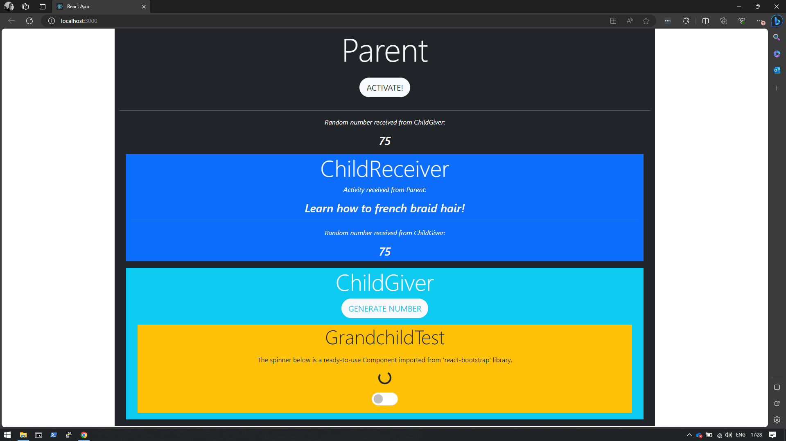

# PT_Demo_React_MyFamilyApp



## Contents
- [General Information](#general-information)
- [Create new React project](#create-new-react-project)
- [Install Bootstrap 5 for React](#install-bootstrap-5-for-react)

## General Information
https://legacy.reactjs.org/docs/handling-events.html

## Create new React project
1. Check if you have ```node```, ```npm``` and ```npx``` installed:
```
node --version
npm --version
npx --version
```
If not, download ```node.js``` from here: https://nodejs.org/en

2. Create new React app using the following command:
```
npx create-react-app my-family-app
```
3. Run the application on default port 3000 using:
```
npm start
```

## Install Bootstrap 5 for React
You can use the following link as a reference:  
https://www.geeksforgeeks.org/how-to-install-bootstrap-in-react-js/

1. In command prompt, set the React project directory as current:
```
cd my-familty-app
```
2. Using node package manager, install bootstrap:
```
npm install bootstrap
```
3. in ```index.js```, add the following on top:
```
import 'bootstrap/dist/css/bootstrap.min.css';
import 'bootstrap/dist/js/bootstrap.bundle.min';
```
4. Using node package manager, install jquery popper.js:
```
npm install jquery popper.js
```
5. ```in index.js```, add the following 2 lines below the lines added in step 3:
```
import 'bootstrap/dist/css/bootstrap.min.css';
import 'bootstrap/dist/js/bootstrap.bundle.min';
import $ from 'jquery';
import Popper from 'popper.js';
```